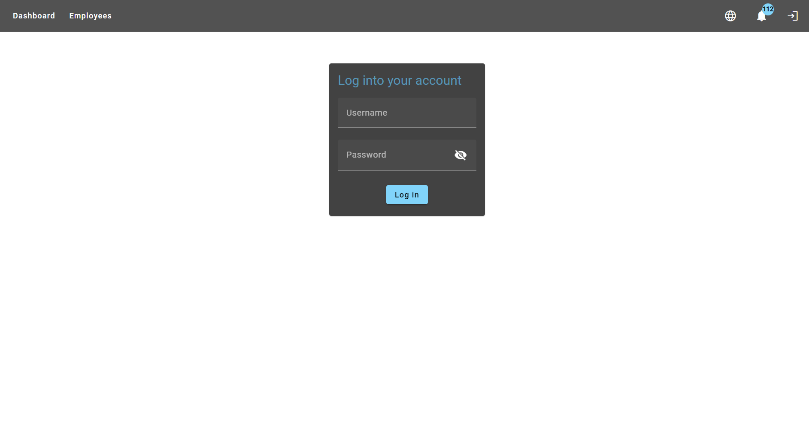
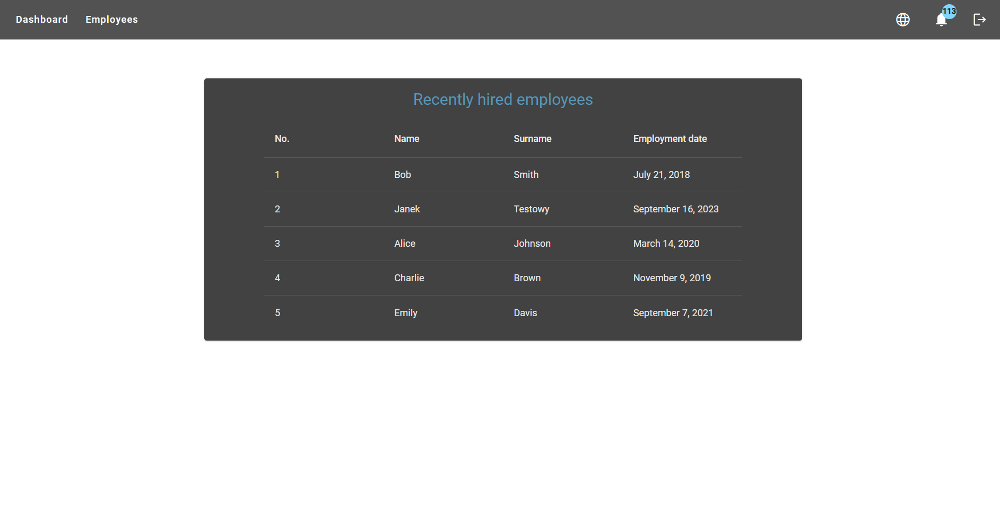
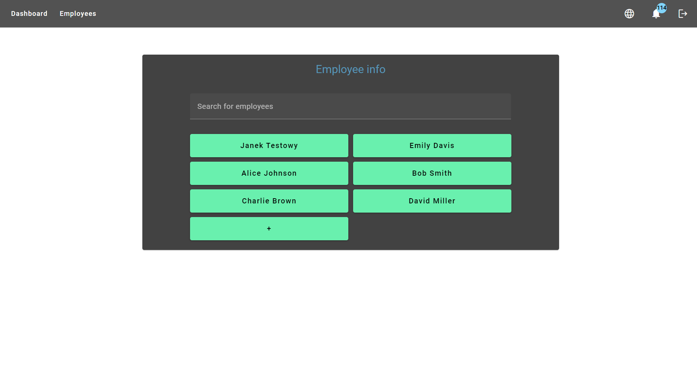
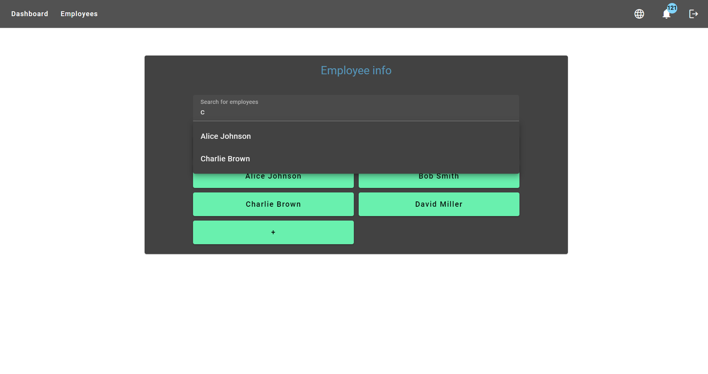
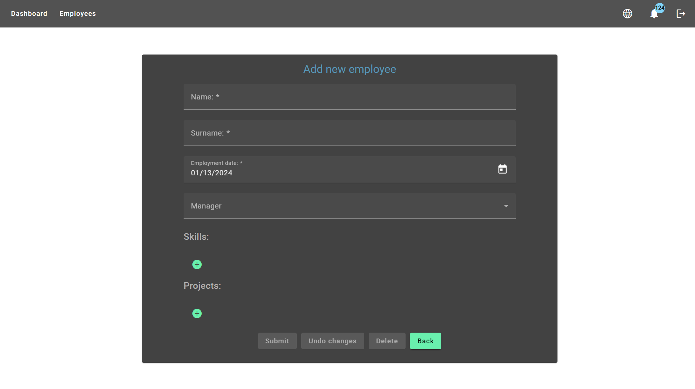
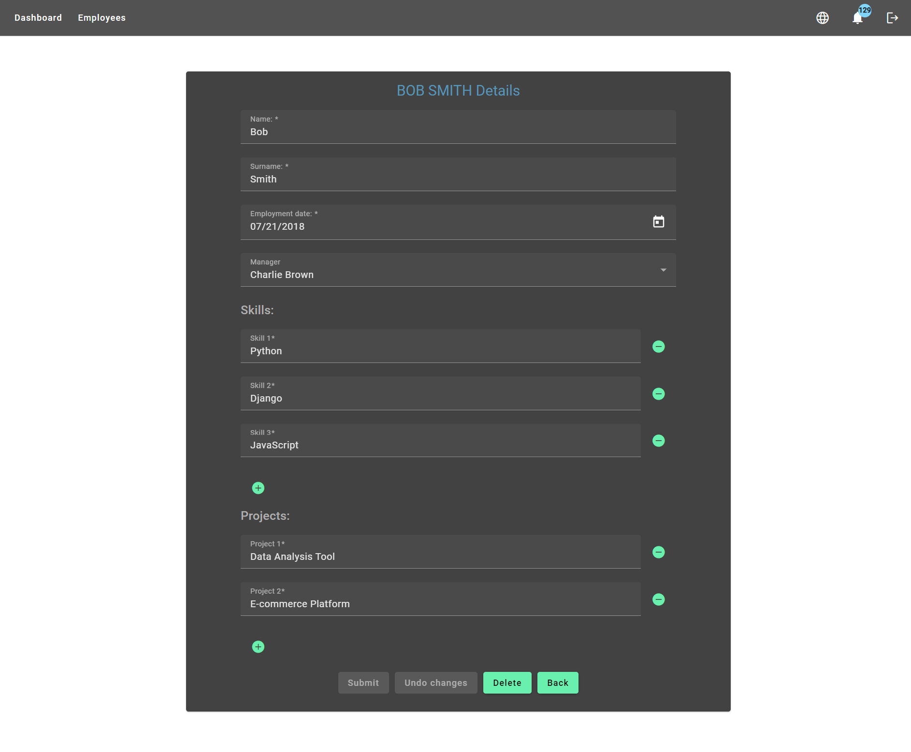
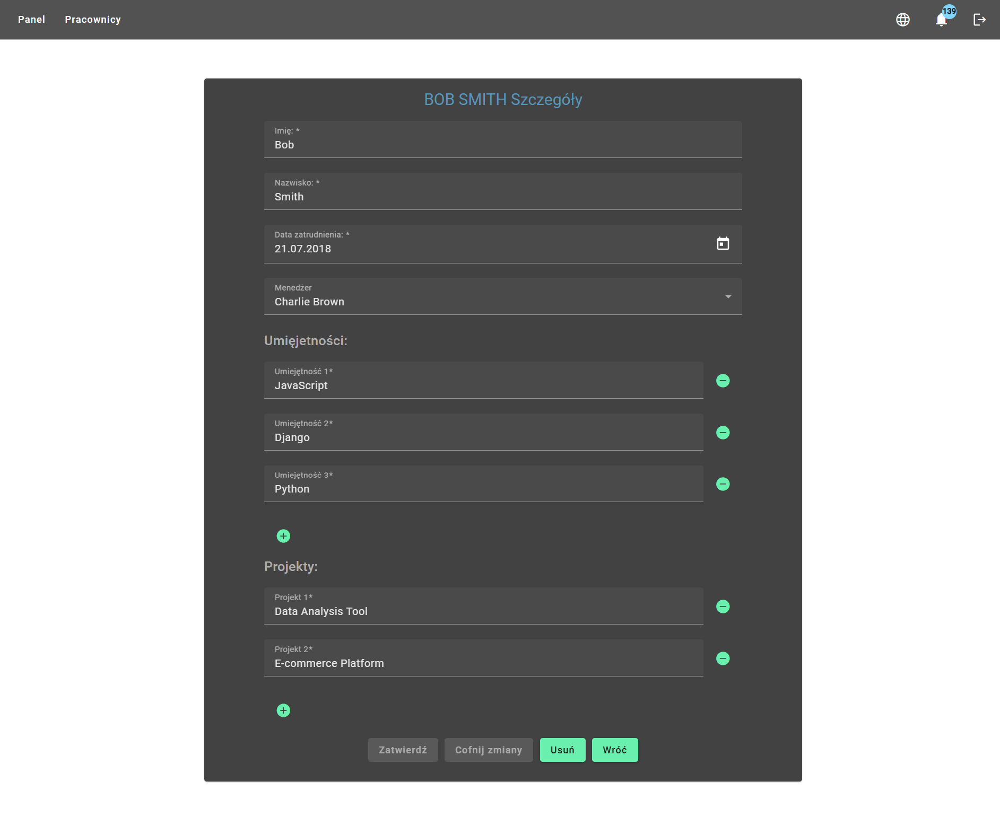
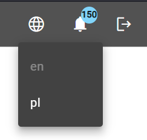
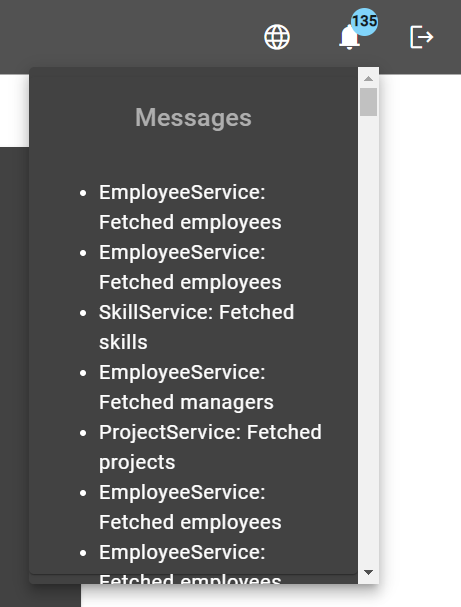

# employee-app

A full-stack application for managing employees within a company.

## Features
* User authentication
* Landing page with a dasboard containg the most important data about recently employed employees
* List of all employees
* Search bar for employees
* Adding, editing and removing an employee
* Elaborate form for storing data about an employee, including separate lists of data
* Notifications window
* Support for languages: English, Polish

## Technology stack

### FrontEnd

* Angular 16
* TypeScript
* SCSS
* Angular Material
* RxJS
* ngx-translate
* ESLint-Prettier
* For tests:
    * Jasmine
    * Karma

### BackEnd

* Java 17
* SpringBoot
* Spring Security
* Gradle
* Lombok
* Mapstruct
* PostreSQL
* Swagger
* For tests:
    * JUnit 5
    * Mockito
    * H2

## Screenshots

### Login

    

### Dashboard

    

### Employees

    

### Employee search

    

### Add employee

    

### Edit employee

    

### Page in other language

    

### Languages

    

### Messages

    

